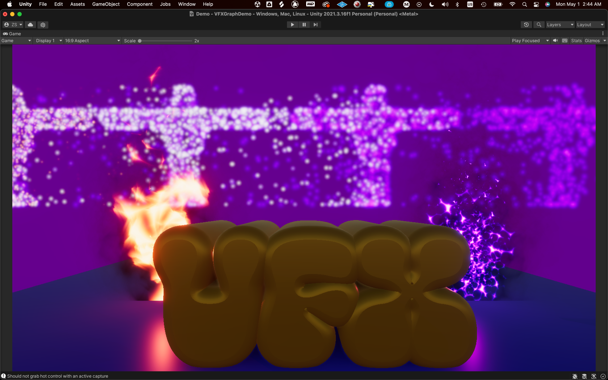
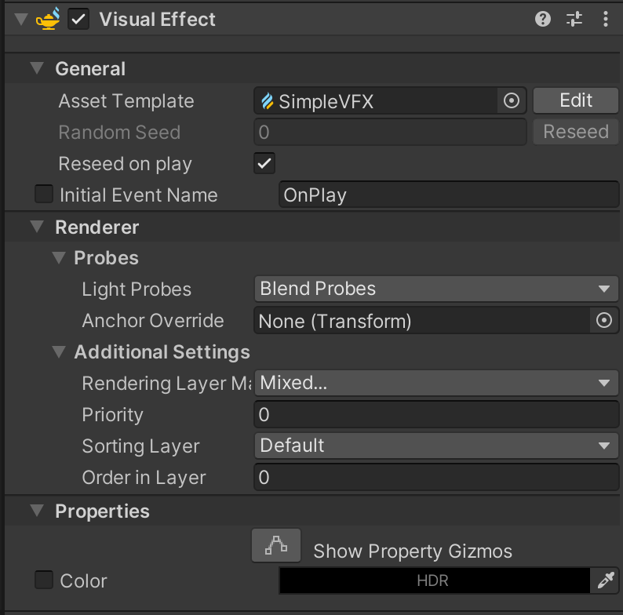
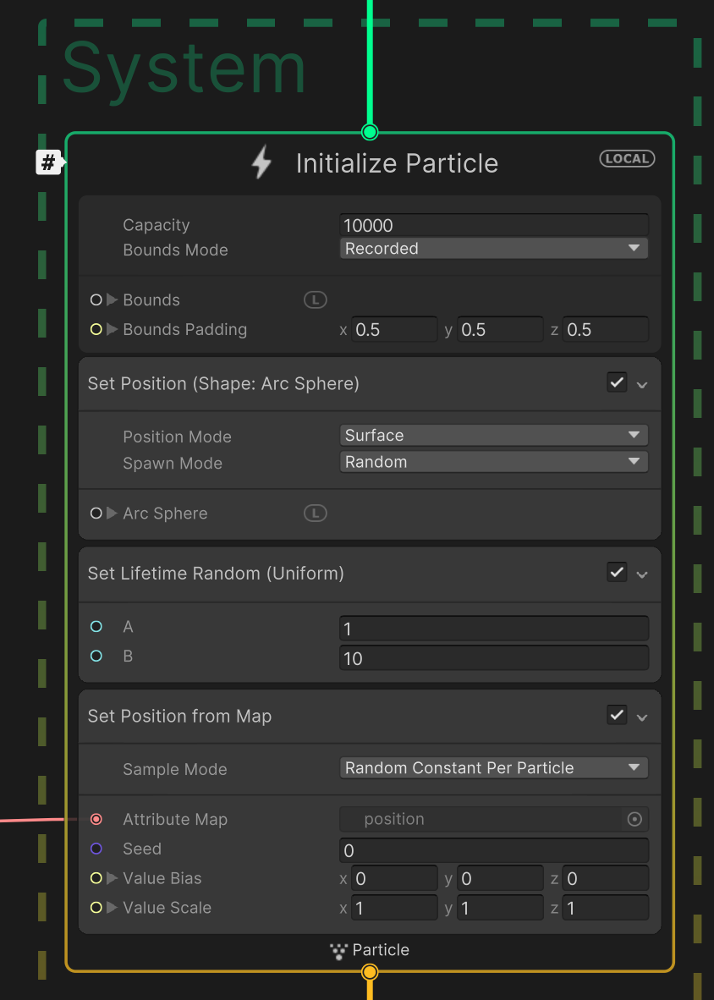
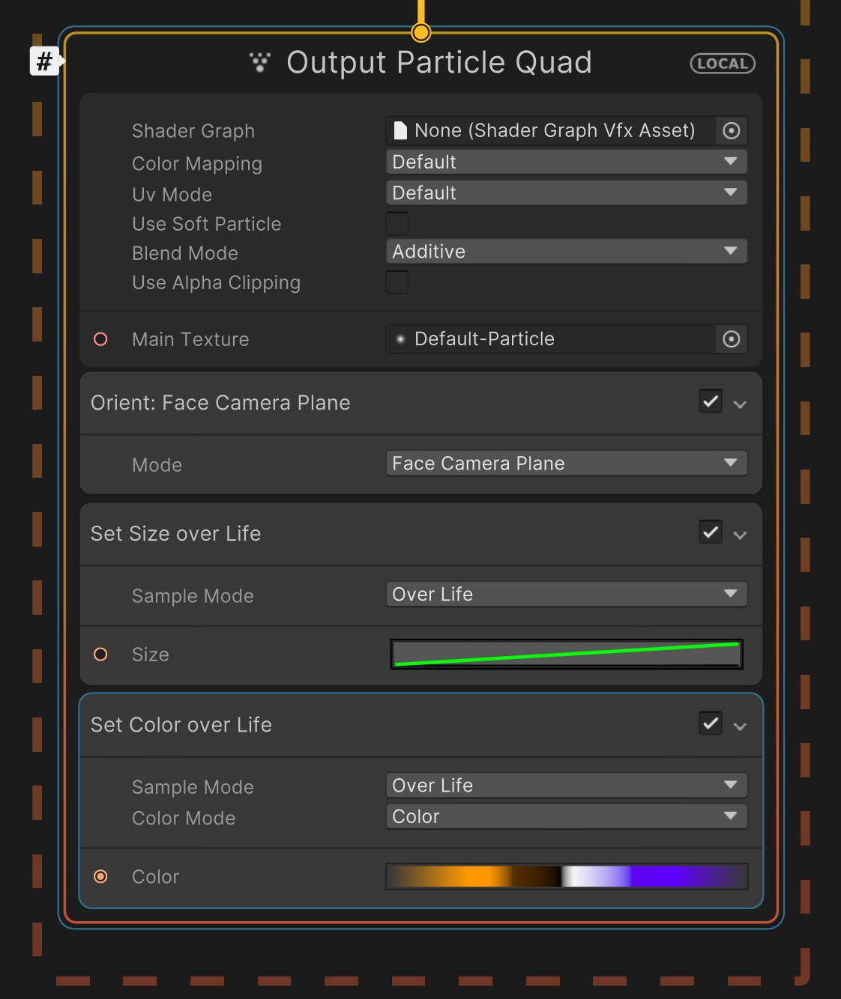
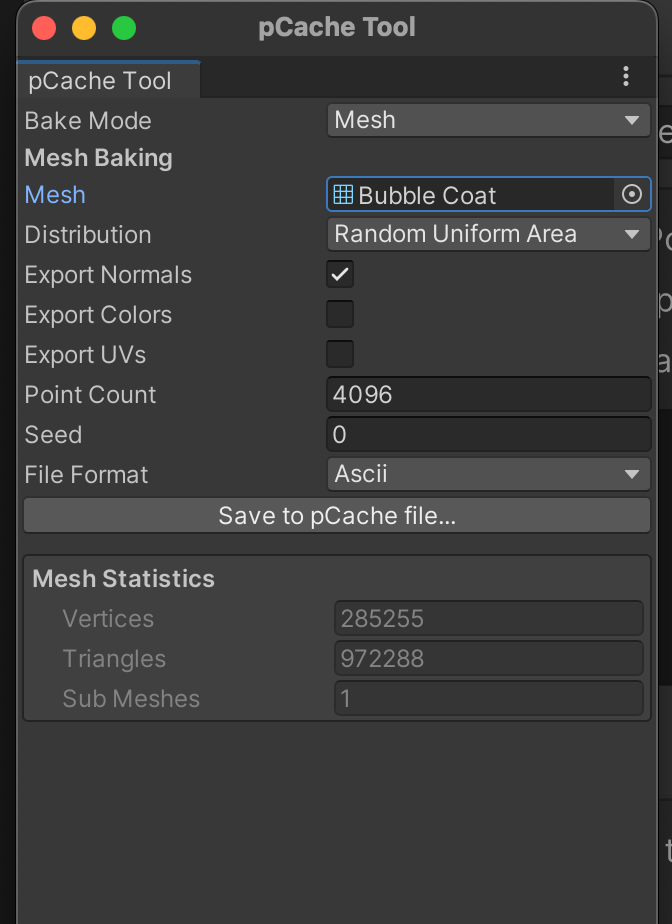
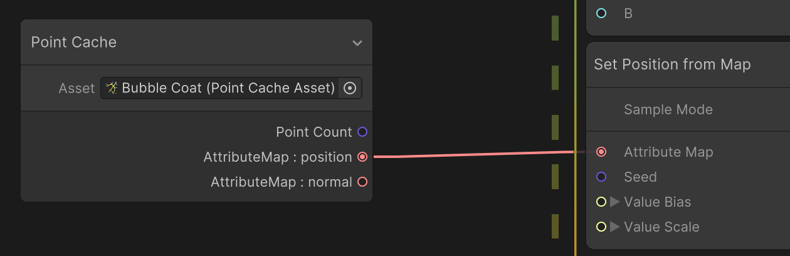
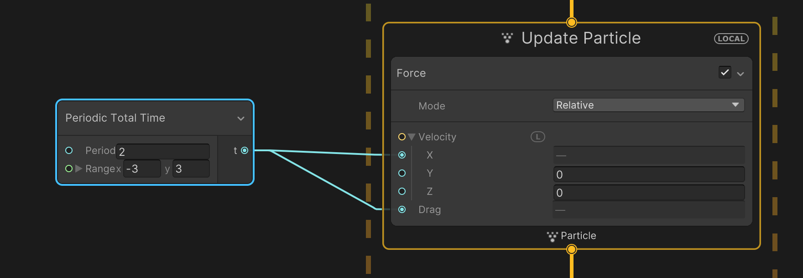
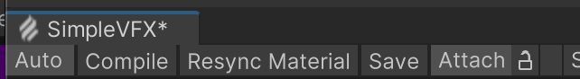
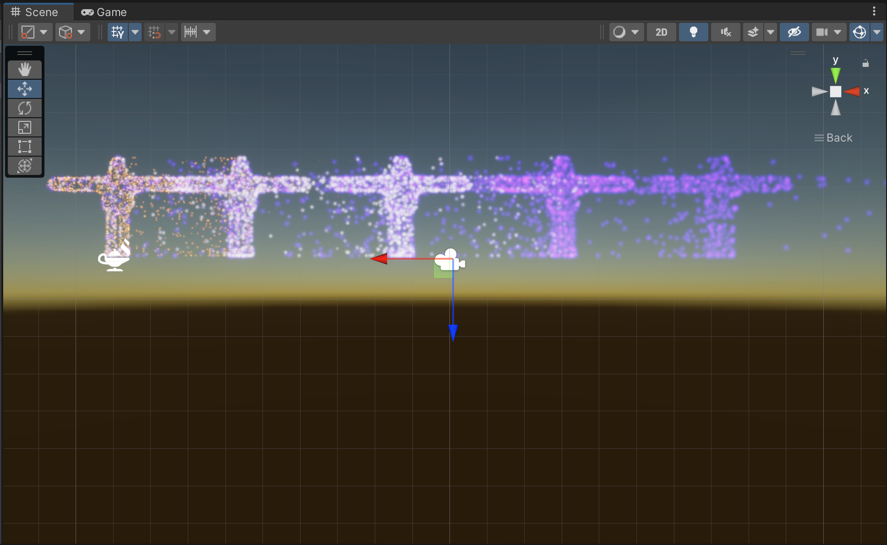

# VFXGraph Demo
 Demo Project using VFX Graph

# QuickStart to VFX Graph

This will be a walkthrough of how to create the particle character in back of the photo. For this tutorial you will need a 3D model.

1. Open a New Unity Project and make sure "Visual Effect Graph" and "High Definition RP" are installed.
2. In your Asset Folder, Right Click and Create/Visual Effect and click "Visuals Effect Graph". Name this file.
3. Drag file into the scene's hierachy. Click on the file and click edit

4. Now you are in the the VFX Graph.
5. Update Constant Spawn Rate to 1000
6. moving Downward, change Capcity to 1000. /right click inside the "Initialize Particle" block, select "create block". type in "Set Position(Shape: Arc Sphere)" and click. Follow the same steps to create a "Set Position from Map". Right Click "Set Velocity Random" and delete the block. Adjust Set Lifetome Random A = 1 and B = 10.

7. Next move down to "Output Particle Quad", Set Blend mode to "Additive, make the "Main Texture": "Default-Particle", and click the white color box and assign the colors you would like the particles to be.

8. Now go to the main Unity window and click Window/Visual Effects/Utilies/Point Cache Bake Tool. Click the Mesh slot, select your model and then click "Save to pCache file". We will be using this in the VFX Graph.

9. Go back to your VFX edit Graph and create a "Point Cache" block. Select your newly made Point Cache as the asset. Connect the AttributeMap: position to the AttributeMap of "Set Position from Map"

10. Lastly add "Force: in the Update Particle Group. Create a "Perdoic Total Time" block and connect t to the x and drag of Force. Set Period to 2 and rangex to -3 and rangey 3.

11. Save

12. Excitment*

#### *color and position may vary

### Sources:
- [Stylized Fire in Unity VFX Graph Tutorial](https://www.youtube.com/watch?v=XQlFokCzU6M)
- [VFX Graph in Unity](https://www.youtube.com/watch?v=r2Eoy3-p-xc)
- [Youtube Creator with several tutorials on VFX Graph and the Shader Graph](https://www.youtube.com/@GabrielAguiarProd/videos)